# GPT Image 2 提示词收录库

一个专门收录 `GPT Image 2` 高价值提示词的仓库。

这里不只是在堆提示词，而是在整理一套真正方便复用的素材库：
- 先看效果
- 再看适用场景
- 最后直接复制提示词或继续改写

> 适合自己收藏，也适合公开传播。

## 这是什么

这个仓库把分散在网页、社群、截图、聊天记录里的好提示词，整理成可长期积累的卡片库。

你可以在这里快速找到：
- 想做什么图，用哪类提示词
- 同一种视觉风格，有哪些可复用写法
- 只有“纯提示词”时，怎么规范入库

## 一眼看懂

| 指标 | 当前内容 |
| --- | --- |
| 提示词卡片 | `45` 条 |
| 使用场景 | `12` 类 |
| 标签入口 | `22` 个 |
| 收录方式 | `inbox 快速收集 + library 正式归档` |

## 从哪里开始

### 如果你想直接找灵感

- 看 [精选提示词](#精选提示词)
- 看 [按使用场景浏览](#按使用场景浏览)
- 看 [热门效果标签](#热门效果标签)

### 如果你想把外部提示词也收进来

- 快速收录说明：[inbox/README.md](inbox/README.md)
- 纯提示词模板：[templates/inbox-prompt-only-entry.md](templates/inbox-prompt-only-entry.md)
- 正式卡片模板：[templates/prompt-card.md](templates/prompt-card.md)
- 自动转正式卡片：`npm run import:prompt -- inbox/your-entry.md`

### 如果你第一次来到这个仓库

推荐按这个顺序逛：
1. 先看 `精选提示词`
2. 再按你的使用目的进入场景目录
3. 最后根据风格标签继续横向扩展

## 精选提示词

| 封面 | 标题 | 适用场景 | 效果标签 |
| --- | --- | --- | --- |
| 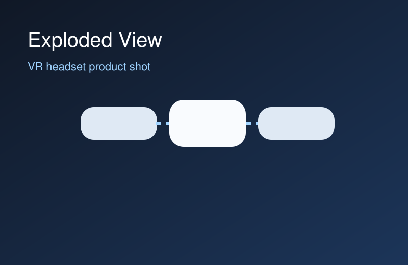 | [VR 头显爆炸视图](library/product-showcase/vr-headset-exploded-view.md) | 产品展示图 | 爆炸视图 / 3D 渲染 |
| 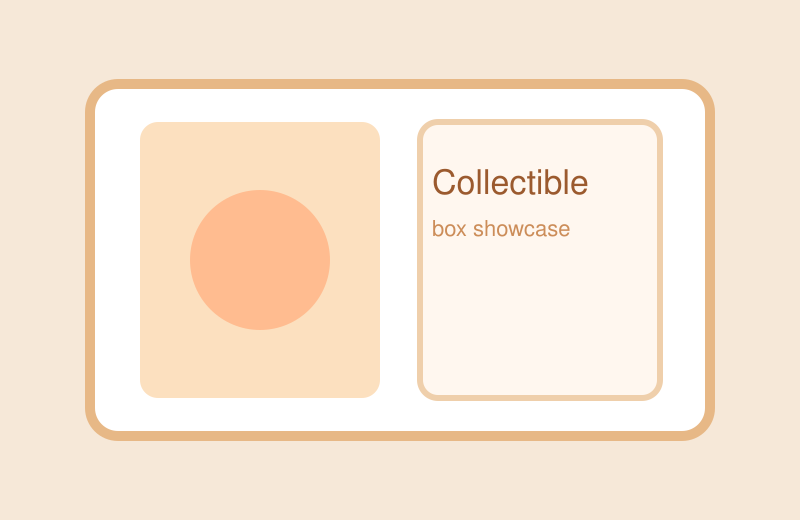 | [收藏级手办盒装图](library/product-showcase/collectible-box-packshot.md) | 产品展示图 | 盲盒包装 / 亚克力质感 |
| 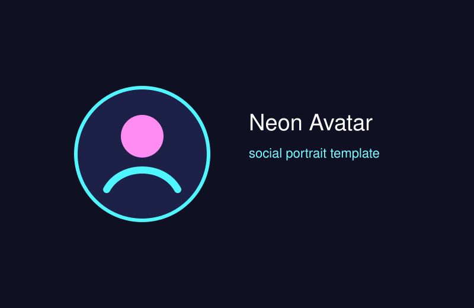 | [霓虹科技人像头像](library/social-avatar/neon-tech-avatar.md) | 社媒头像 / 形象图 | 科技感 / 赛博光效 |
| 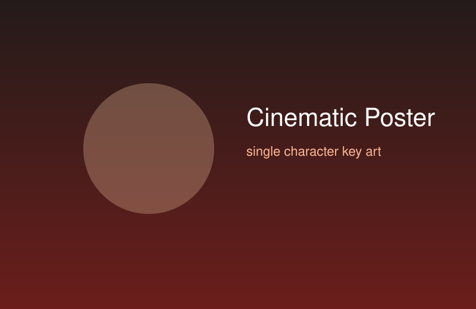 | [电影级单人物海报](library/poster-cover/cinematic-character-poster.md) | 海报封面 | 电影海报感 / 戏剧灯光 |
| 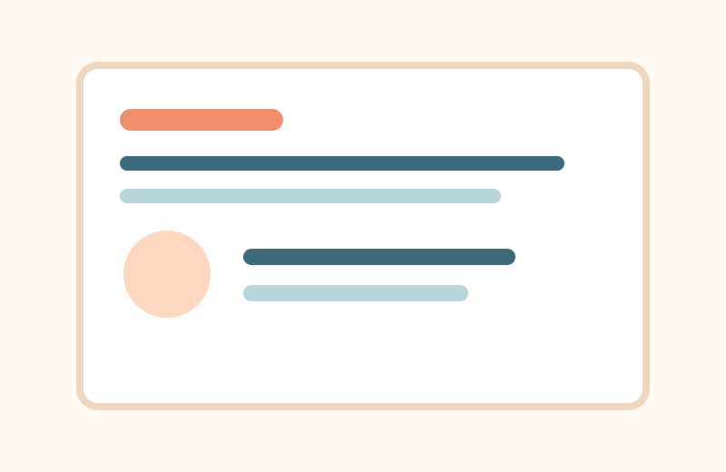 | [日系信息图卡片](library/explainer-visual/japanese-style-infographic.md) | 说明示意图 | 信息图 / 日系排版 |
| 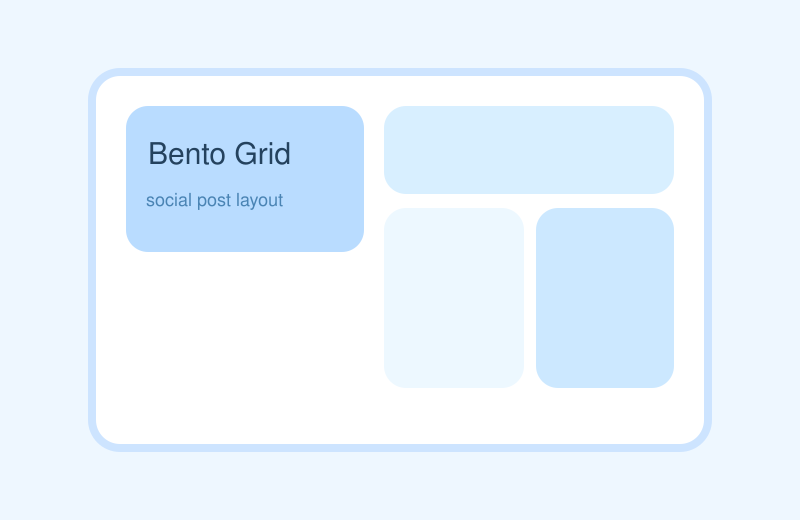 | [液态玻璃 Bento 社媒图](library/social-media-post/liquid-glass-bento-product-post.md) | 社媒贴文 | Bento Grid / 液态玻璃 |
| 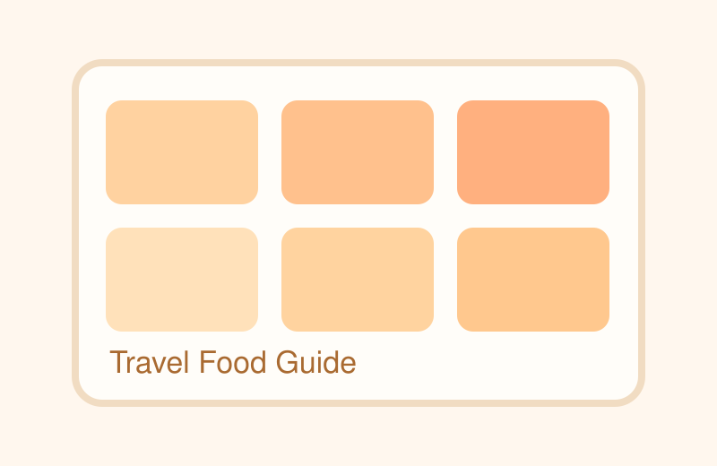 | [五一旅行美食推荐海报](library/social-media-post/may-day-travel-food-guide-poster.md) | 社媒贴文 | 旅行美食 / 9比16海报 |
| 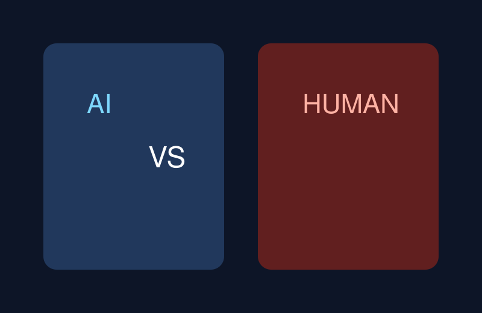 | [AI 工具对比缩略图](library/youtube-thumbnail/ai-tool-vs-human-thumbnail.md) | YouTube 缩略图 | 强对比 / 夸张表情 |
| 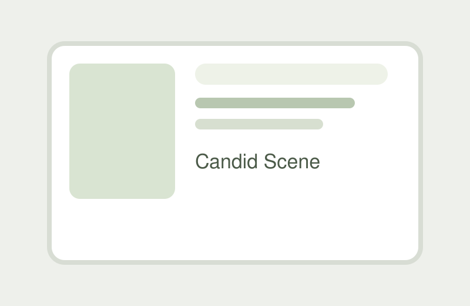 | [便利店抓拍叙事照](library/brand-visual-lab/candid-convenience-store-scene.md) | 品牌视觉实验 | 生活方式摄影 / 抓拍感 |
| 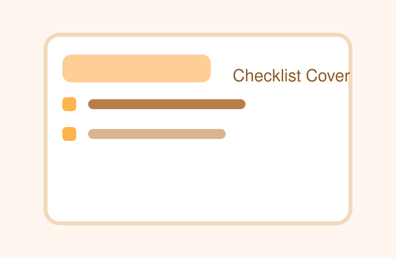 | [爆款清单型首图](library/xiaohongshu-cover/viral-checklist-cover.md) | 小红书封面 / 图文首图 | 清单感 / 高信息密度 |
| 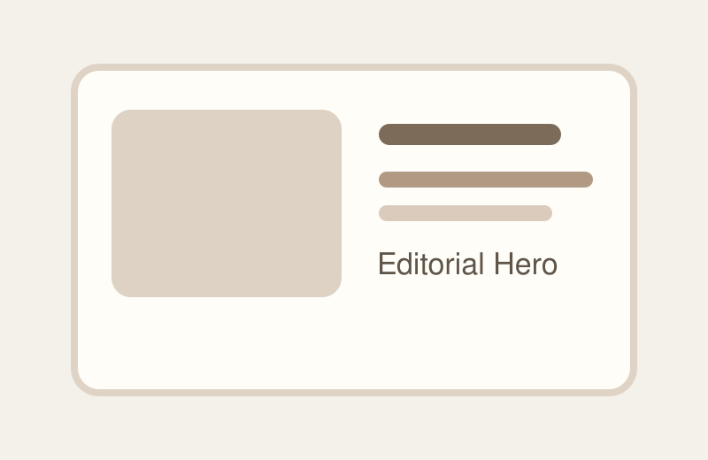 | [公众号长文头图](library/wechat-article-visual/editorial-wechat-hero-cover.md) | 公众号头图 / 长图知识卡 | 杂志感 / 标题空间 |
| 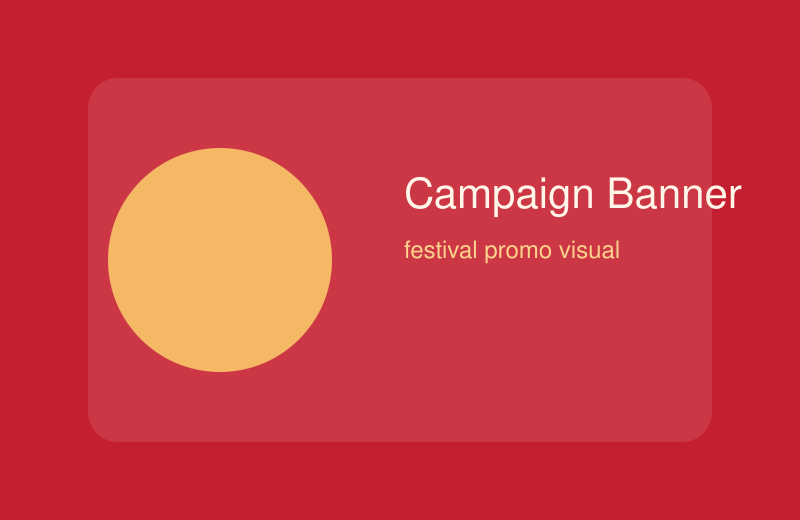 | [大促氛围横幅图](library/ecommerce-banner/festival-campaign-hero-banner.md) | 电商详情页 / Banner 主视觉 | 大促氛围 / 横幅主视觉 |
| 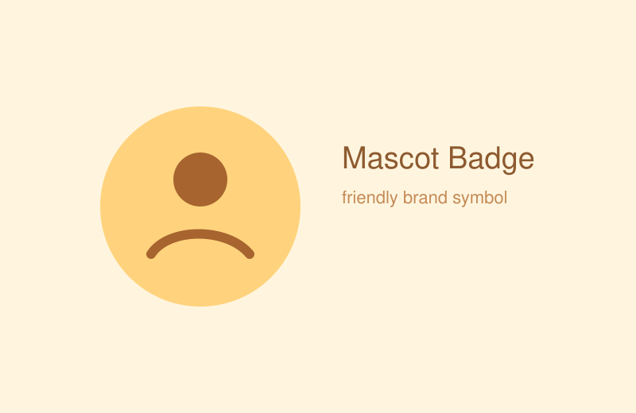 | [圆润吉祥物徽章图](library/logo-ip-mascot/rounded-mascot-badge-system.md) | LOGO / IP 角色 / 吉祥物视觉 | 吉祥物 / 徽章感 |
| 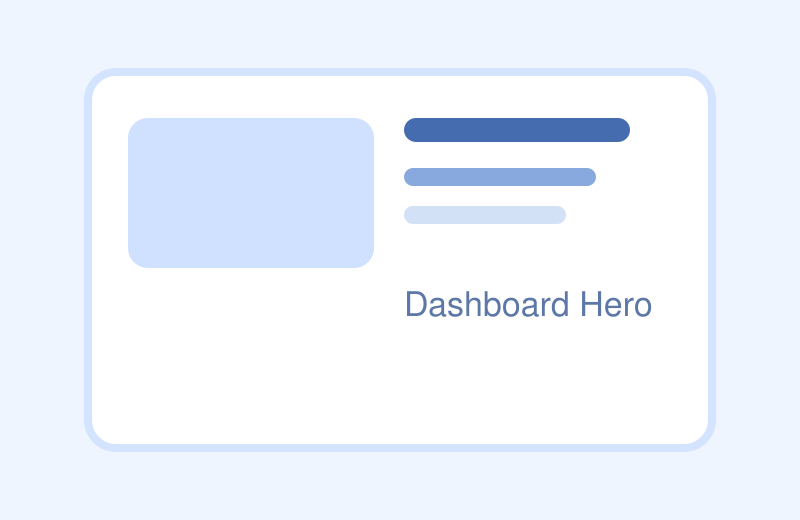 | [SaaS 仪表盘官网首屏图](library/ui-app-mockup/saas-dashboard-hero-mockup.md) | UI 截图 / App Mockup / Landing Page Visual | SaaS 官网 / 仪表盘 |
| 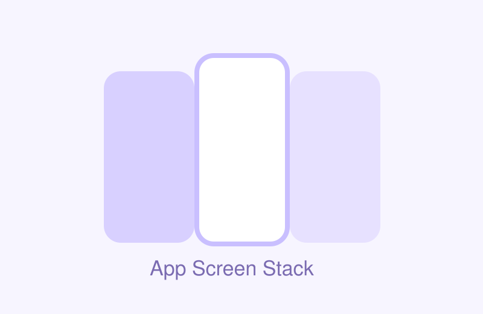 | [App 截图堆叠展示图](library/ui-app-mockup/mobile-app-screen-stack.md) | UI 截图 / App Mockup / Landing Page Visual | App 截图 / 设备样机 |

## 按使用场景浏览

| 场景 | 适合找什么 |
| --- | --- |
| [产品展示图](library/product-showcase/README.md) | 爆炸视图、包装图、单品主视觉 |
| [社媒头像 / 形象图](library/social-avatar/README.md) | 头像、人设图、个人品牌形象 |
| [海报封面](library/poster-cover/README.md) | 人物海报、活动主视觉、封面图 |
| [说明示意图](library/explainer-visual/README.md) | 信息图、流程图、结构说明图 |
| [社媒贴文](library/social-media-post/README.md) | 可收藏卡片、知识图、旅行海报 |
| [YouTube 缩略图](library/youtube-thumbnail/README.md) | 强点击视频封面、对比型缩略图 |
| [品牌视觉实验](library/brand-visual-lab/README.md) | 世界观、叙事摄影、概念提案 |
| [小红书封面 / 图文首图](library/xiaohongshu-cover/README.md) | 清单首图、教程封面、对比首图 |
| [公众号头图 / 长图知识卡](library/wechat-article-visual/README.md) | 长文头图、知识长图、引言卡片 |
| [电商详情页 / Banner 主视觉](library/ecommerce-banner/README.md) | 活动横幅、卖点图、礼盒主视觉 |
| [LOGO / IP 角色 / 吉祥物视觉](library/logo-ip-mascot/README.md) | 吉祥物、IP 角色、Logo 概念展示 |
| [UI 截图 / App Mockup / Landing Page Visual](library/ui-app-mockup/README.md) | 官网首屏、App 样机、产品截图 |

## 热门效果标签

### 高传播视觉

- [小红书封面](tags/xiaohongshu-cover.md)
- [YouTube 缩略图](tags/youtube-thumbnail.md)
- [公众号头图](tags/wechat-hero.md)
- [长图知识卡](tags/longform-knowledge-card.md)

### 品牌与商业

- [电商 Banner](tags/ecommerce-banner.md)
- [详情页卖点图](tags/detail-feature-banner.md)
- [品牌吉祥物](tags/brand-mascot.md)
- [Logo 视觉](tags/logo-visual.md)

### 视觉风格

- [爆炸视图](tags/exploded-view.md)
- [盲盒包装](tags/blind-box-packaging.md)
- [黏土风](tags/clay-style.md)
- [电影海报感](tags/cinematic-poster.md)
- [黑板手绘](tags/chalkboard-style.md)
- [Bento Grid](tags/bento-grid.md)

### 内容与界面

- [信息图](tags/infographic.md)
- [数学可视化](tags/mathematical-visualization.md)
- [SaaS 官网视觉](tags/saas-landing-visual.md)
- [App 截图展示](tags/app-screen-mockup.md)
- [VN UI](tags/vn-ui.md)
- [3D 渲染](tags/3d-render.md)
- [生活方式摄影](tags/lifestyle-photography.md)
- [教程首图](tags/tutorial-cover.md)

## 最近新增

- 2026-05-03: 新增 `1` 条旅行美食海报示例，并补充“只有提示词时如何入库”的仓库规范。
- 2026-05-03: 新增 `4` 条 UI 截图 / App Mockup / Landing Page Visual，总量来到 `45` 条，扩展到 `12` 个使用场景。
- 2026-05-03: 新增 `4` 条 LOGO / IP 角色 / 吉祥物视觉。
- 2026-05-03: 新增 `4` 条电商详情页 / Banner 主视觉。
- 2026-05-03: 新增 `4` 条公众号头图 / 长图知识卡。
- 2026-05-03: 新增 `4` 条小红书封面卡片。

## 如何使用

1. 先从 `精选提示词` 找到最接近你目标的视觉方向。
2. 再进入对应的场景目录，筛到你真正要做的图。
3. 打开单条卡片，直接复制提示词，再替换主体词、风格词或平台语境。
4. 如果你从外部看到不错的提示词，先收进 [inbox](inbox/README.md)，后续再转正式卡片。

## 收录原则

- 中文说明为主，方便整理和检索。
- 提示词正文优先保留英文，必要时混合中文描述。
- 每条内容尽量保留来源链接或明确标记为 `self-curated`。
- 首页只展示精选内容，完整库以分类目录和标签页为准。
- 只有纯提示词也可以正式收录，只要来源和适用场景足够清楚。

## 仓库结构

```text
.
├── assets/          # 缩略图与封面素材
├── inbox/           # 待整理候选区
├── library/         # 正式提示词库
├── scripts/         # 仓库校验脚本与导入脚本
├── tags/            # 标签索引
├── templates/       # 卡片模板与收录规范
└── tests/           # 仓库结构测试
```
