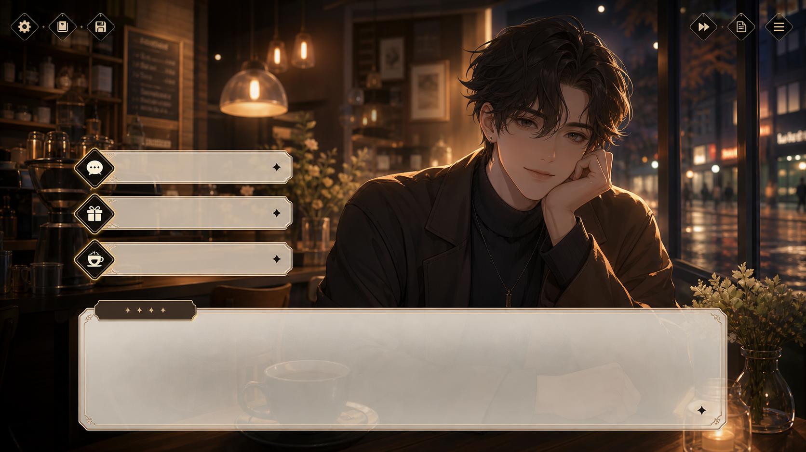

# 咖啡店 VN UI 世界观图

## 效果预览



## 适合什么时候用

适合品牌世界观提案、游戏感产品介绍、IP 视觉稿、叙事型 landing 配图和活动概念图。

## 提示词

```text
Create a cinematic visual novel UI mockup set inside a cozy coffee shop, warm ambient lighting, character portrait framing, dialogue box at the bottom, layered interface elements, polished anime-inspired but mature art direction, emotional storytelling mood, premium game menu composition, intimate world-building feel.
```

## 使用建议

- 最重要的关键词是 `visual novel UI mockup` 和 `dialogue box at the bottom`。
- 可以把咖啡店换成书店、酒吧、展厅、办公室等空间。
- 如果想更像网页提案而不是游戏界面，可以弱化 `game menu composition`。

## 变量说明

- 优先替换提示词里的占位变量，例如 `{主体}`、`{城市名称}`、`{产品名称}`、`{品牌风格}`。
- 如果没有显式占位变量，就替换主体名词、场景名词和发布渠道，保留构图、材质、光线和比例约束。
- 标签和 `scene` 用于检索，不一定需要原样写进生成提示词。

## 生成注意事项

- 生成后优先检查文字、数字、地图、UI 元素和品牌标识是否准确。
- 如果画面包含真实城市、路线、产品结构或界面细节，建议补充更具体的空间关系和视觉约束。
- 如果第一次结果偏乱，先减少信息量，再逐步增加卡片、标签或装饰元素。

## 来源

- 原始来源：参考 YouMind `Image Prompts` 列表中的 `Cinematic Coffee Shop VN UI Mockup` 条目：[YouMind Image Prompts](https://youmind.com/prompts/image)
- 收录时间：`2026-05-03`
