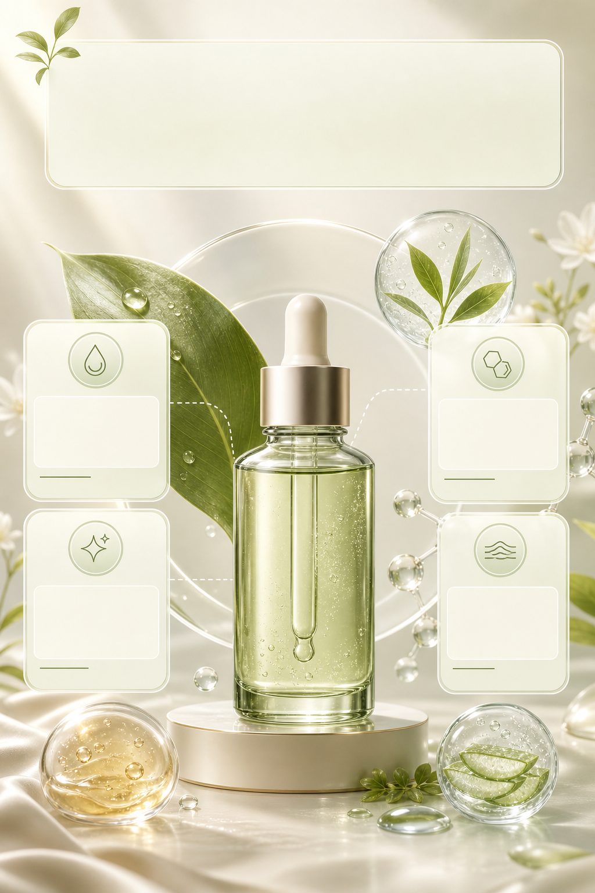

# 护肤成分卖点详情图

## 效果预览



## 适合什么时候用

适合精华、面霜、防晒、洗护、香氛等产品的成分说明、功效分区和详情页卖点图。

## 提示词

```text
Create a skincare ingredient feature detail image for an e-commerce product page, elegant cream and soft green palette, one cosmetic bottle with floating ingredient elements, 4 benefit cards, clean scientific beauty layout, translucent panels, premium lighting, ample text space, polished commercial design, trustworthy but not medical.
```

## 使用建议

- 避免直接写医疗承诺，保留 `trustworthy but not medical`。
- 如果有具体成分，可以替换 `floating ingredient elements`。
- 文字建议后期人工排版，图片先生成结构和质感。

## 变量说明

- 优先替换提示词里的占位变量，例如 `{主体}`、`{城市名称}`、`{产品名称}`、`{品牌风格}`。
- 如果没有显式占位变量，就替换主体名词、场景名词和发布渠道，保留构图、材质、光线和比例约束。
- 标签和 `scene` 用于检索，不一定需要原样写进生成提示词。

## 生成注意事项

- 生成后优先检查文字、数字、地图、UI 元素和品牌标识是否准确。
- 如果画面包含真实城市、路线、产品结构或界面细节，建议补充更具体的空间关系和视觉约束。
- 如果第一次结果偏乱，先减少信息量，再逐步增加卡片、标签或装饰元素。

## 来源

- 原始来源：`self-curated`
- 收录时间：`2026-05-03`
