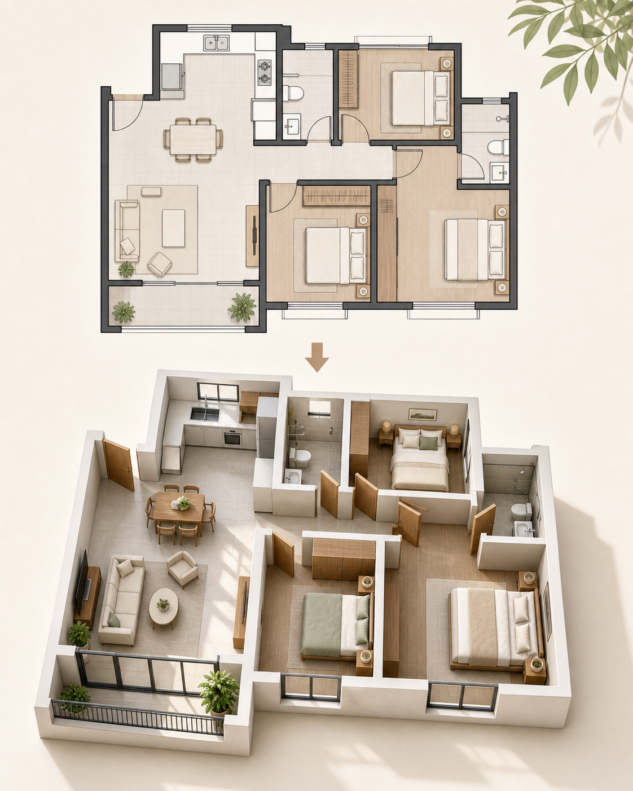

# 平面户型转 3D 示意图

## 效果预览



## 适合什么时候用

适合房产、家装、展位、空间规划和功能区说明图。

## 提示词

```text
Transform a simple 2D apartment floor plan into a clean 3D isometric render, preserving room relationships, soft natural materials, bright daylight, architectural visualization quality, easy-to-read layout, minimal staging, elegant explanatory feel, realistic yet simplified presentation.
```

## 使用建议

- 适合搭配一张平面线稿作为输入参考。
- 如果要更像产品说明图，可加 `annotated zones`。
- 如果你更重视视觉氛围，可补 `interior design magazine quality`。

## 变量说明

- 优先替换提示词里的占位变量，例如 `{主体}`、`{城市名称}`、`{产品名称}`、`{品牌风格}`。
- 如果没有显式占位变量，就替换主体名词、场景名词和发布渠道，保留构图、材质、光线和比例约束。
- 标签和 `scene` 用于检索，不一定需要原样写进生成提示词。

## 生成注意事项

- 生成后优先检查文字、数字、地图、UI 元素和品牌标识是否准确。
- 如果画面包含真实城市、路线、产品结构或界面细节，建议补充更具体的空间关系和视觉约束。
- 如果第一次结果偏乱，先减少信息量，再逐步增加卡片、标签或装饰元素。

## 来源

- 原始来源：`self-curated`
- 收录时间：`2026-05-02`
