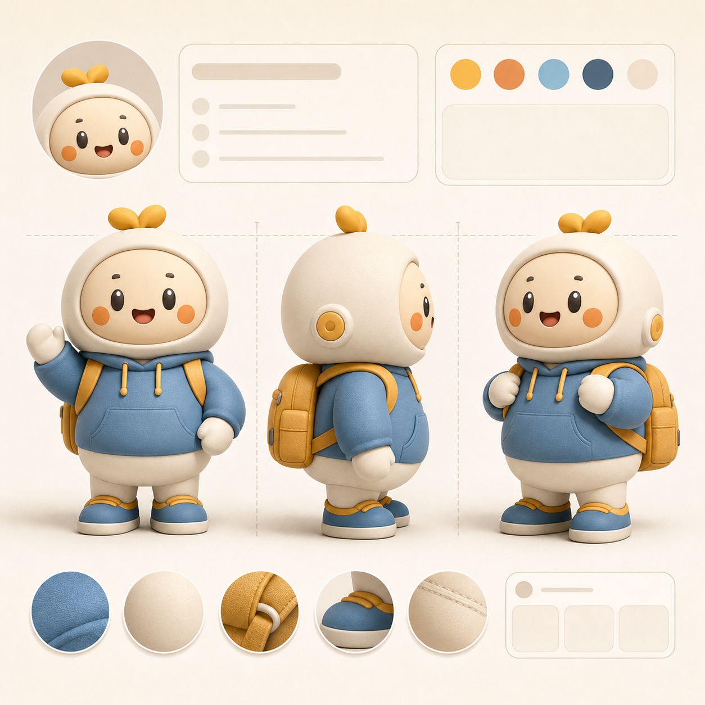

# 3D 品牌吉祥物设定图

## 效果预览



## 适合什么时候用

适合品牌提案、角色设定、IP 延展、包装视觉、活动海报和周边开发。

## 提示词

```text
Design a polished 3D brand mascot turnaround sheet, front and side character views, soft toy-like material, premium studio lighting, expressive but simple face, consistent proportions, collectible-character quality, suitable for brand identity decks, packaging, event visuals and merchandise development.
```

## 使用建议

- 关键词 `front and side character views` 很适合做提案页和设定页。
- 如果想更偏手办感，可补 `vinyl toy finish`。
- 如果想更偏品牌主视觉，可弱化 turnaround，强化 pose 和 hero shot。

## 变量说明

- 优先替换提示词里的占位变量，例如 `{主体}`、`{城市名称}`、`{产品名称}`、`{品牌风格}`。
- 如果没有显式占位变量，就替换主体名词、场景名词和发布渠道，保留构图、材质、光线和比例约束。
- 标签和 `scene` 用于检索，不一定需要原样写进生成提示词。

## 生成注意事项

- 生成后优先检查文字、数字、地图、UI 元素和品牌标识是否准确。
- 如果画面包含真实城市、路线、产品结构或界面细节，建议补充更具体的空间关系和视觉约束。
- 如果第一次结果偏乱，先减少信息量，再逐步增加卡片、标签或装饰元素。

## 来源

- 原始来源：`self-curated`
- 收录时间：`2026-05-03`
