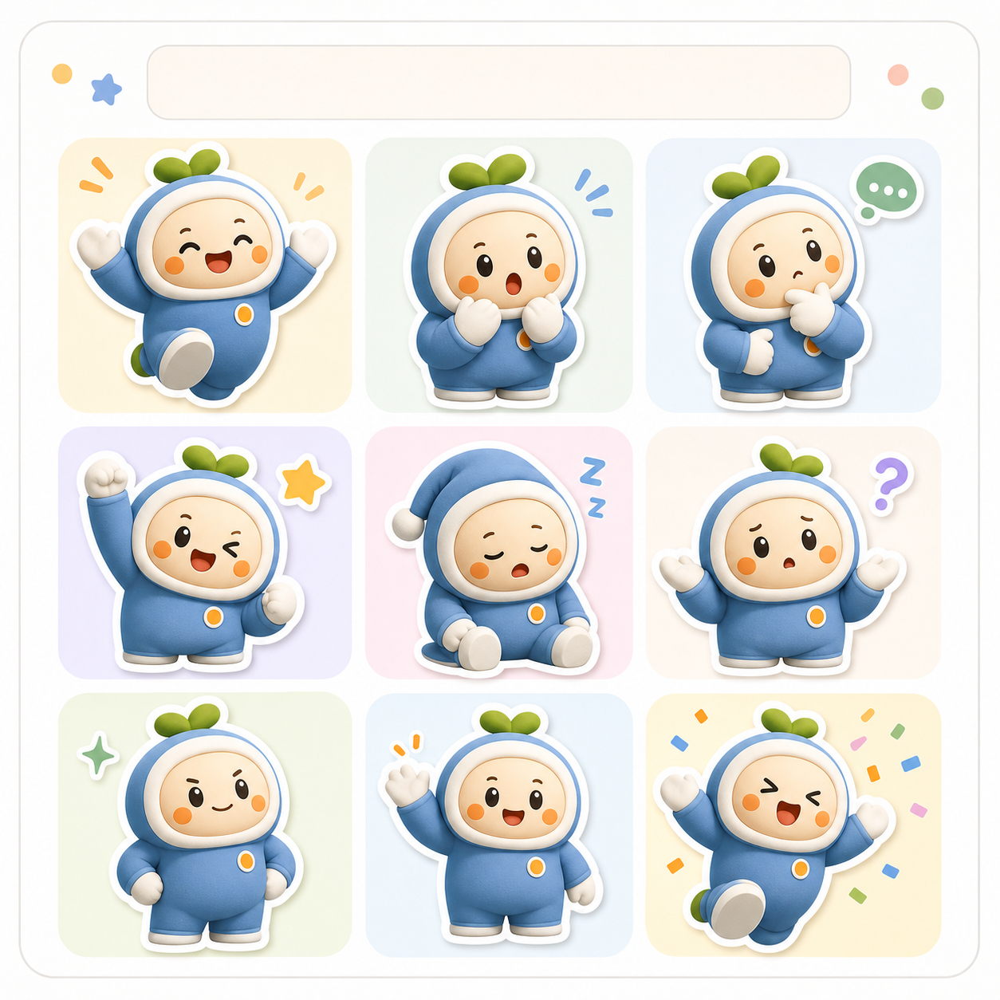

# 成套 IP 表情包设定图

## 效果预览



## 适合什么时候用

适合社区运营、品牌社媒、活动贴纸、开屏插画、产品空状态和会员互动内容。

## 提示词

```text
Create a mascot expression sheet for a brand IP character, multiple emotions and poses, clean grid layout, consistent proportions, highly readable facial changes, polished sticker-pack charm, bright but controlled palette, suitable for social media packs, onboarding moments, event visuals and community branding.
```

## 使用建议

- 这条特别适合把品牌角色做成后续可持续产出的资产库。
- 如果你需要更像聊天表情，可以补 `chat sticker style`。
- 如果你更偏品牌手册展示，可以补 `brand guideline sheet`。

## 变量说明

- 优先替换提示词里的占位变量，例如 `{主体}`、`{城市名称}`、`{产品名称}`、`{品牌风格}`。
- 如果没有显式占位变量，就替换主体名词、场景名词和发布渠道，保留构图、材质、光线和比例约束。
- 标签和 `scene` 用于检索，不一定需要原样写进生成提示词。

## 生成注意事项

- 生成后优先检查文字、数字、地图、UI 元素和品牌标识是否准确。
- 如果画面包含真实城市、路线、产品结构或界面细节，建议补充更具体的空间关系和视觉约束。
- 如果第一次结果偏乱，先减少信息量，再逐步增加卡片、标签或装饰元素。

## 来源

- 原始来源：`self-curated`
- 收录时间：`2026-05-03`
