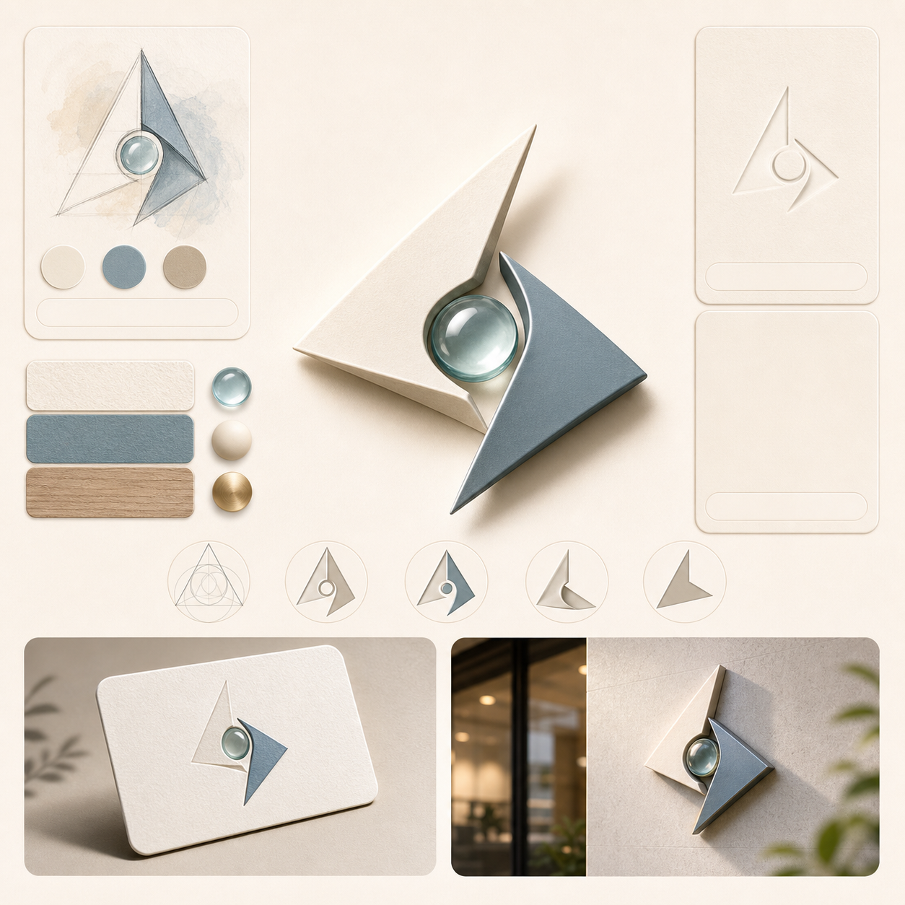

# 拟物 Logo 场景图

## 效果预览



## 适合什么时候用

适合品牌提案、标识设计展示、案例包装、视觉探索和品牌叙事页。

## 提示词

```text
Create an object-inspired logo visual presentation, transforming a brand concept into a tactile symbolic mark, elegant composition, refined material cues, clean presentation board, premium identity design mood, simple but memorable silhouette, suitable for pitch decks, brand case studies and visual identity exploration.
```

## 使用建议

- 很适合把品牌关键词先提炼成一个物件或材料隐喻再生成。
- 如果你已经有 logo，可以把它当参考图再做这一类延展展示。
- 适合用于提案，而不是直接当最终 logo 定稿。

## 变量说明

- 优先替换提示词里的占位变量，例如 `{主体}`、`{城市名称}`、`{产品名称}`、`{品牌风格}`。
- 如果没有显式占位变量，就替换主体名词、场景名词和发布渠道，保留构图、材质、光线和比例约束。
- 标签和 `scene` 用于检索，不一定需要原样写进生成提示词。

## 生成注意事项

- 生成后优先检查文字、数字、地图、UI 元素和品牌标识是否准确。
- 如果画面包含真实城市、路线、产品结构或界面细节，建议补充更具体的空间关系和视觉约束。
- 如果第一次结果偏乱，先减少信息量，再逐步增加卡片、标签或装饰元素。

## 来源

- 原始来源：`self-curated`
- 收录时间：`2026-05-03`
