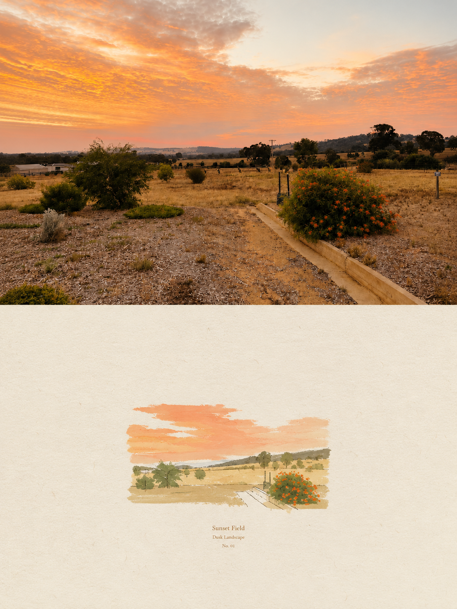

# 编辑摄影视觉诗海报

## 效果预览



> 该图为用户使用本提示词在 GPT 中生成的效果图，已作为本地真实预览回填。

## 外部参考效果图

- [参考图 1](https://pbs.twimg.com/media/HRD1ozRbEAAKOOR.jpg?name=orig)
- [参考图 2](https://pbs.twimg.com/media/HRD1ozMbIAAEOG8.jpg?name=orig)
- [参考图 3](https://pbs.twimg.com/media/HRD1ozLaMAAdVAc.jpg?name=orig)
- [参考图 4](https://pbs.twimg.com/media/HRD1ozfbYAEA3eo.jpg?name=orig)

## 适合什么时候用

适合把人物照、旅行照、建筑照、生活方式照片做成高级杂志封面、独立出版物封面、艺术项目封面或作品集视觉页。

## 提示词

```text
Create one independent high-end editorial poster for each uploaded photo. Do not combine multiple photos into a collage. Each photo must be processed and output as a separate poster.

OVERALL FORMAT
整体格式

Strict 3:4 vertical composition.
严格的 3:4 垂直构图。

Divide the canvas horizontally into two exactly equal sections, with a precise 1:1 height ratio.
将画布水平分为两半，两部分的高度比例必须精确地为 1:1。

The top half occupies exactly 50% of the canvas.
上半部分占据了整个画布的 50%。

The bottom half occupies exactly 50% of the canvas.
下半部分占据了整个画布的 50%。

The two sections should feel visually connected as one refined art publication cover.
这两部分应该像一本经过精心设计的艺术出版物封面那样，在视觉上保持连贯性。

TOP HALF — ORIGINAL PHOTOGRAPH
上半部分——原始照片

Preserve the original photograph as faithfully as possible.
请尽可能忠实地保留原始照片的样貌。

Keep the main composition, subjects, identity, facial features, body proportions, poses, expressions, clothing, objects, and spatial relationships unchanged.
保持主要的构图、主体、身份特征、面部表情、身体比例、姿势、服装、物体以及空间关系等元素不变。

Preserve the realistic photographic texture, natural lighting, shadows, atmosphere, and original color mood.
保留逼真的照片质感、自然光照、阴影效果、氛围感以及原始的颜色氛围。

Apply only subtle, sophisticated editorial color grading, creating the feeling of a premium magazine photograph, contemporary art book, or high-end independent publication.
仅使用柔和、精致的编辑级色彩调校技术，从而营造出类似高级杂志照片、当代艺术书籍或高端独立出版物的效果。

The image should remain photorealistic and authentic, never overly retouched or artificially stylized.
这张图片应该保持逼真的视觉效果，并且要真实可信，绝不可进行过度修饰或人为的风格化处理。

If necessary to fit the 3:4 composition naturally, extend the sky, ground, walls, or surrounding environmental background.
如果为了自然地呈现 3:4 的比例布局而需要，可以扩展天空、地面、墙壁以及周围的环境背景。

Background extension must feel seamless and photographic.
背景延伸效果必须看起来非常自然，就像拍摄出来的照片一样。

Never stretch, distort, reshape, replace, or alter the main subject.
切勿拉伸、扭曲、重塑、替换或改变主体对象。

BOTTOM HALF — MINIMAL HAND-DRAWN PAPER ILLUSTRATION
下半部分——最少的手工绘制的纸制插图

Extract the most recognizable visual elements from the original photograph and reinterpret them as a minimalist hand-drawn paper-cover illustration.
从原始照片中提取最具有辨识度的视觉元素，并将其重新诠释为简洁的手绘纸张封面插图。

Preserve:
保留：

The most recognizable subject
最容易被辨认的主题

Essential silhouette and proportions
基本的轮廓与比例

Key pose or gesture
关键的姿势或手势

Important objects
重要的对象

The core narrative relationship between people and objects
人与物体之间的核心叙事关系

Highly simplify the image. Remove unnecessary details and retain only the visual information needed for immediate recognition.
对图像进行了高度简化。去除了不必要的细节，只保留了对即时识别来说必要的视觉信息。

Use:
用途：

Delicate, slightly imperfect hand-drawn lines
精致而略带不完美的手绘线条

A small number of bold, clearly defined acrylic-style flat color shapes
少数几个大胆且轮廓分明的丙烯酸风格的单色平面形状

Rough paper texture
粗糙的纸张质地

Visible handmade brush marks
明显的手工刷绘痕迹

Slightly irregular, organic edges
略带不规则的有机边缘

Subtle imperfections that make it feel genuinely handmade
那些细微的瑕疵，让人感觉它确实是手工制作的。

The main illustrated subject should be small, centered, and carefully composed, occupying approximately 10–20% of the bottom half.
主要插图的主题应该较小，居中放置，构图要精心安排，占据页面下半部分的大约 10-20%区域。

Leave a large amount of negative space around the illustration.
在插画周围留下大量的空白区域。

The background should primarily resemble:
背景应该主要呈现如下效果：

Rough white paper
粗糙的白纸

Warm off-white paper
温暖的白色纸张

Pale natural paper
古朴自然的纸张

Minimal editorial book-cover stock
仅使用最少的编辑式封面模板

Use only a few lines or small color shapes to suggest the surrounding environment.
只需用几行文字或少量色彩形状来描绘周围的环境即可。

COLOR PALETTE
色彩调色板

Extract the dominant colors directly from the original photograph.
直接从原始照片中提取出主要的颜色。

Compress the palette into no more than 4 main colors.
将调色板中的颜色压缩为不超过 4 种主要颜色。

Keep the colors restrained, sophisticated, and harmonious.
保持色彩的克制、精致与和谐。

Use bold but controlled flat color blocks.
使用粗体但颜色较为柔和的单色块进行设计。

Avoid excessive color variation.
避免过多的颜色变化。

Preserve subtle paper grain and handmade brush texture.
保留纸张的细微纹理以及手工绘制的笔触质感。

The illustration should visually feel like a simplified color interpretation of the photograph.
这幅插图在视觉上应该类似于照片的简化色彩表现。

TYPOGRAPHY
字体设计

A small amount of simple typography may be included when appropriate.
在适当的情况下，可以加入少量简单的字体设计元素。

Possible elements:
可能的元素：

A short title
简短的标题

Keyword
关键词

Object name
对象名称

Location
位置/地点

Year
年份

Number
数字

Short phrase
短句/短语

Text should be minimal, understated, and editorial.
文字表达应当简洁明了，不要过于夸张或浮夸，同时要具有编辑性。

Typography should naturally interact with the large areas of negative space and the small illustration, evoking:
排版设计应当自然地与大量的负空间以及小巧的插图相互融合，从而营造出富有层次感的视觉效果。

Art book covers
艺术书籍的封面

Independent publishing
独立出版

Contemporary editorial design
当代编辑设计

Thoughtful children's picture books
富有创意的儿童图画书

Do not force text into the composition if it does not naturally fit the photograph.
如果文本无法自然地与照片搭配在一起，请不要强行将其放入编辑框中。

VISUAL LANGUAGE
视觉语言

The final poster should feel:
最终的海报应该能够让人产生以下感受：

Quiet · Poetic · Refined · Minimal · Innocent · Relaxed · Artistic · Thoughtful · High-recognition · Premium
宁静 · 诗意 · 精致 · 简约 · 纯真 · 放松 · 艺术感强 · 深思熟虑 · 高辨识度 · 高品质

The visual concept should be:
视觉概念应该是：

“A small subject surrounded by a large amount of empty space.”
“一个被大量空白空间包围的小主题。”

The result should resemble a carefully designed independent art publication cover, rather than a commercial advertisement.
这个效果应该类似于精心设计的独立艺术出版物封面，而不是商业广告。

AVOID
避开/不要接触

Do not use:
请勿使用：

Colored-pencil aesthetics
彩色铅笔美学

Crayon textures
crayon 纹理

Bleeding watercolor
血色的水彩画

Pure line-art illustration
纯粹的绘画作品

Complex realistic illustration
复杂的真实感插图

Heavy oil-painting effects
重油绘画效果

Smooth polished digital illustration
光滑抛光的数字插图

3D rendering
3D 渲染

Glossy 3D textures
有光泽的 3D 纹理

Commercial cartoon aesthetics
商业卡通作品的美学风格

Cute commercial character design
可爱的商业角色设计

E-commerce advertising aesthetics
电子商务广告美学

Generic poster templates
通用海报模板

Excessive decorative elements
过多的装饰元素

Busy compositions
繁忙的创作过程

Excessive typography
过度使用字体设计

FINAL ART DIRECTION
最终艺术指导

The top half should feel like a beautiful, authentic editorial photograph.
上半部分应该看起来像一张精美、真实的时尚摄影照片。

The bottom half should feel like a small, handmade visual poem derived from that photograph.
下半部分应该给人一种由那张照片衍生出来的、小巧而手工制作的视觉诗的感觉。

The two halves should clearly belong to the same visual story, while maintaining a strong contrast between photographic realism above and minimal handmade illustration below.
这两部分显然应该属于同一个视觉故事，同时要在摄影般的真实感与简约的手绘插图之间保持强烈的对比。

Prioritize recognition, restraint, negative space, material texture, subtle imperfection, editorial sophistication, and artistic storytelling over decorative complexity.
优先考虑认可度、克制感、负空间设计、材质质感、细微的不完美之处、编辑的精致处理，以及富有艺术性的叙事方式，而非装饰性的复杂性。
```

## 使用建议

- 这条提示词必须配合上传照片使用，不适合纯文本直接生成。
- 一次上传多张图时，要求模型分别输出独立海报，不要拼成合集。
- 如果想保留人物身份或产品外观，重点保留 `Preserve the original photograph as faithfully as possible`。
- 下半部分插画容易变复杂时，追加强调 `small subject, large negative space, no decorative complexity`。

## 变量说明

- `{uploaded photo}`：替换为你上传的原始照片，可以是人物、建筑、旅行、产品或生活方式照片。
- `{short title}`：可选标题，不需要文字时可以要求 `no typography`。
- `{location / year / keyword}`：适合做作品集封面、旅行摄影封面或出版物封面的小字信息。

## 生成注意事项

- 这类图最重要的是上下两段比例，生成后优先检查是否严格接近 1:1。
- 上半部分应保持照片真实感，不能被重绘成插画或 3D。
- 下半部分主体要小、克制、有纸张和手工质感，避免变成商业卡通。
- 外部参考图没有明确授权时，不建议直接存入仓库；公开展示优先使用自己生成或用户授权提供的预览图。

## 来源

- 原始来源：`https://x.com/king1818888/status/2094443914866597977`
- 来源作者：`Kimberly / @king1818888`
- 收录时间：`2026-09-01`
