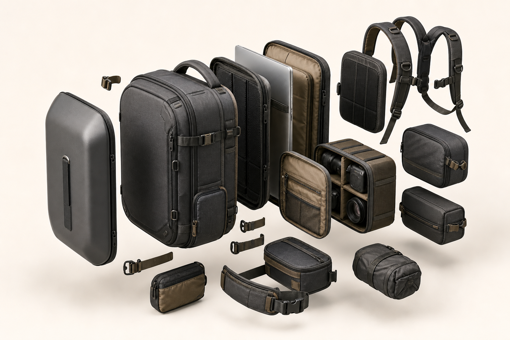

# 模块化背包爆炸视图

## 效果预览



## 适合什么时候用

适合背包、收纳包、户外装备、摄影包、模块化硬件和产品结构说明图。

## 提示词

```text
Create a premium exploded-view product render of a modular travel backpack, front shell, laptop compartment, camera cube, straps, buckles, pockets, zippers, and accessory modules floating apart in clean alignment, isometric studio composition, realistic fabric texture, matte hardware, soft shadows, no labels, high-end product catalog style.
```

## 使用建议

- 替换产品名即可改成行李箱、相机包、工具箱等。
- 保留 `floating apart in clean alignment`，这是爆炸视图的关键。
- 如需说明文字，建议后期单独加标注。

## 变量说明

- 优先替换提示词里的占位变量，例如 `{主体}`、`{城市名称}`、`{产品名称}`、`{品牌风格}`。
- 如果没有显式占位变量，就替换主体名词、场景名词和发布渠道，保留构图、材质、光线和比例约束。
- 标签和 `scene` 用于检索，不一定需要原样写进生成提示词。

## 生成注意事项

- 生成后优先检查文字、数字、地图、UI 元素和品牌标识是否准确。
- 如果画面包含真实城市、路线、产品结构或界面细节，建议补充更具体的空间关系和视觉约束。
- 如果第一次结果偏乱，先减少信息量，再逐步增加卡片、标签或装饰元素。

## 来源

- 原始来源：`self-curated`
- 收录时间：`2026-05-03`
