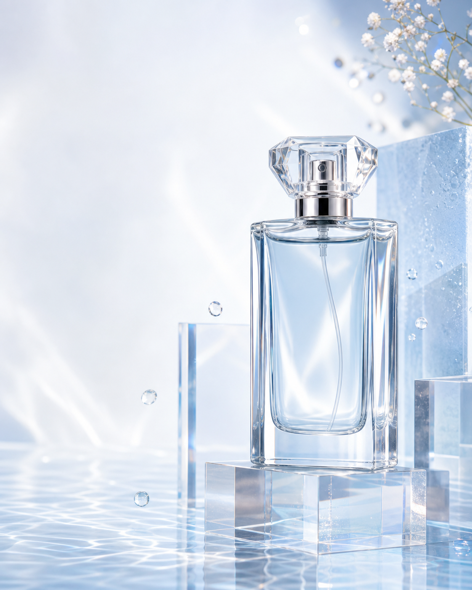

# 透明亚克力香水广告图

## 效果预览



## 适合什么时候用

适合美妆、香水、护肤、饮料等需要通透材质和高级光感的商品图。

## 提示词

```text
Create a luxury perfume product advertisement with a transparent acrylic bottle, floating over reflective water, bright daylight highlights, clean pastel background, realistic liquid refraction, premium cosmetic campaign styling, elegant composition, high-end beauty photography mood, ultra polished details.
```

## 使用建议

- 把 `perfume` 替换成具体商品即可复用。
- 如果想要更梦幻，可补 `soft caustic light patterns`。
- 如果想要更像电商详情页主图，去掉 `reflective water`，换成 `floating over soft gradient background`。

## 变量说明

- 优先替换提示词里的占位变量，例如 `{主体}`、`{城市名称}`、`{产品名称}`、`{品牌风格}`。
- 如果没有显式占位变量，就替换主体名词、场景名词和发布渠道，保留构图、材质、光线和比例约束。
- 标签和 `scene` 用于检索，不一定需要原样写进生成提示词。

## 生成注意事项

- 生成后优先检查文字、数字、地图、UI 元素和品牌标识是否准确。
- 如果画面包含真实城市、路线、产品结构或界面细节，建议补充更具体的空间关系和视觉约束。
- 如果第一次结果偏乱，先减少信息量，再逐步增加卡片、标签或装饰元素。

## 来源

- 原始来源：`self-curated`
- 收录时间：`2026-05-02`
