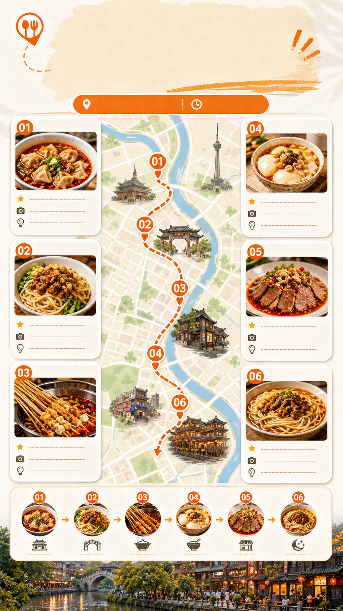

# 城市美食地图路线海报

## 效果预览



## 适合什么时候用

适合城市美食攻略、夜市路线、旅行公众号配图、小红书收藏型图文和节假日出行内容。

## 提示词

```text
Create a 9:16 city food map poster for {city name}, recommend 6 local foods along a realistic walkable food route, bright appetizing style, simplified city map, numbered food pins, small food photography cards, route line from lunch to late-night snack, warm cream background, clean Xiaohongshu travel guide layout, high appetite food visuals, practical and collectible.
```

## 使用建议

- 适合和“城市名称 + 具体区域”一起使用，例如“成都宽窄巷子周边”。
- 如果要准确路线，补充 6 个店铺或街区名称。
- 生成后建议人工检查地图方向和地名准确性。

## 变量说明

- 优先替换提示词里的占位变量，例如 `{主体}`、`{城市名称}`、`{产品名称}`、`{品牌风格}`。
- 如果没有显式占位变量，就替换主体名词、场景名词和发布渠道，保留构图、材质、光线和比例约束。
- 标签和 `scene` 用于检索，不一定需要原样写进生成提示词。

## 生成注意事项

- 生成后优先检查文字、数字、地图、UI 元素和品牌标识是否准确。
- 如果画面包含真实城市、路线、产品结构或界面细节，建议补充更具体的空间关系和视觉约束。
- 如果第一次结果偏乱，先减少信息量，再逐步增加卡片、标签或装饰元素。

## 来源

- 原始来源：`self-curated`
- 收录时间：`2026-05-03`
