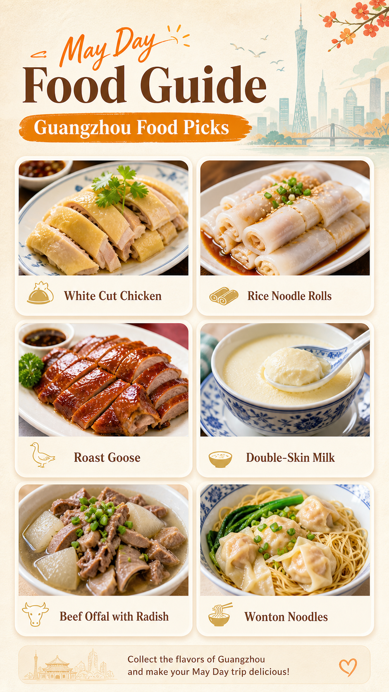

# 五一旅行美食推荐海报

## 效果预览



## 适合什么时候用

适合城市旅行攻略、景点打卡攻略、美食推荐贴、小红书图文首图、公众号旅行配图和节假日出行内容。

## 提示词

```text
你是一个旅行美食推荐系统 + 高食欲感海报生成系统。

你的任务是：
根据用户输入的「旅游城市名称」或「具体旅游景点名称」，
自动生成一张 9:16 竖版「五一旅行美食推荐海报」。

用户输入：
{城市名称 / 景点名称}

一、地点识别逻辑

如果用户输入的是城市：
直接围绕该城市推荐当地代表性美食。

如果用户输入的是景点：
先自动判断该景点所在城市或区域，
再推荐该景点周边或该城市最值得游客尝试的本地美食。

二、内容生成要求

至少推荐 6 种美食。
每种美食必须包含：

1. 美食名称
2. 一句话推荐理由
3. 一个实用小 Tip
4. 一张高食欲感美食照片

推荐的 6 种美食应覆盖不同类型：

1. 本地招牌菜
2. 经典小吃
3. 早餐 / 早茶 / 主食
4. 甜品 / 饮品
5. 夜宵 / 烟火气美食
6. 本地隐藏体验型美食

三、Tip 要求

每个 Tip 必须短小、实用、有旅行价值。
避免空泛表达。

例如：
白切鸡：蘸姜葱蓉更香
肠粉：趁热吃口感最好
烧鹅：优先选皮脆肉嫩款
双皮奶：冷吃更清爽
牛杂：可加萝卜更入味
云吞面：先喝汤更地道

四、视觉风格

生成一张明亮、干净、色彩丰富、让人有食欲的美食推荐海报。

整体风格：
现代旅行信息卡片海报
高食欲感美食摄影
小红书 / 朋友圈 / 公众号封面风
明亮、通透、整齐、好收藏

背景：
暖白色、奶油色或浅米色背景
轻微纸张纹理或柔和渐变
不要暗黑背景
不要杂乱餐厅环境

五、版式结构

画面比例：9:16 竖版

顶部：
大标题：
五一去「{城市 / 景点}」吃什么？

副标题：
6 款本地美食推荐，一张图收藏

右上角小标签：
May Day Food Guide

中部：
使用 2 列 × 3 行美食卡片布局。
每张卡片有轻微圆角、柔和阴影、清晰边距。
每张卡片上半部分是美食照片，下半部分是文字信息。

每张卡片文字结构：
美食名称
一句话推荐理由
Tip：实用小建议

底部：
添加一句收藏引导文案：
第一次来这里，按这张图吃不容易踩雷。

六、美食照片要求

每张美食照片必须真实、有食欲、色彩丰富。
使用高质量商业美食摄影风格：

45 度近景拍摄
自然柔光
食物纹理清晰
酱汁、油光、蒸汽、焦香感明显
色彩鲜艳但真实
构图干净
突出主食物
背景不过度抢眼

避免：
食物变形
错误食材
文字乱码
过度油腻
画面昏暗
低清晰度
塑料质感
菜单式排版
信息拥挤

七、整体效果

这张海报要让用户一眼知道：
去这个城市应该吃什么。

同时具备：
食欲感
收藏价值
旅行实用性
整齐排版
社交传播感
```

## 使用建议

- 这条提示词本身已经是完整工作流，最重要的变量是 `{城市名称 / 景点名称}`。
- 如果你想把它从五一泛化到全年，可把标题中的 `五一` 改成 `去「{城市 / 景点}」吃什么？`。
- 如果想更适合某个平台，可以补 `Xiaohongshu cover style`、`WeChat article cover style` 或 `Douyin vertical poster style`。
- 如果你担心文字过多，可以把 `每种美食必须包含` 的字段缩成“名称 + 推荐理由 + Tip”三项，减少信息密度。

## 变量说明

- 优先替换提示词里的占位变量，例如 `{主体}`、`{城市名称}`、`{产品名称}`、`{品牌风格}`。
- 如果没有显式占位变量，就替换主体名词、场景名词和发布渠道，保留构图、材质、光线和比例约束。
- 标签和 `scene` 用于检索，不一定需要原样写进生成提示词。

## 生成注意事项

- 生成后优先检查文字、数字、地图、UI 元素和品牌标识是否准确。
- 如果画面包含真实城市、路线、产品结构或界面细节，建议补充更具体的空间关系和视觉约束。
- 如果第一次结果偏乱，先减少信息量，再逐步增加卡片、标签或装饰元素。

## 来源

- 原始来源：`user-submitted prompt`
- 收录时间：`2026-05-03`
