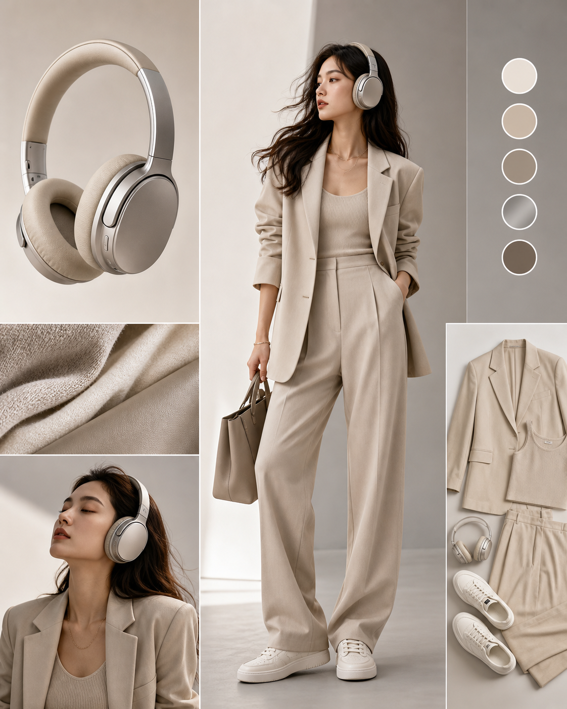

# 产品灵感服装企划图

## 效果预览



## 适合什么时候用

适合品牌内容、审美账号、概念企划、时尚提案、产品延展灵感图。

## 提示词

```text
Using [product] as the visual inspiration, design a fashion editorial concept featuring a matching outfit set, coordinated materials and colors, elegant pose, clean studio backdrop, premium lookbook presentation, modern styling board feeling, aspirational but commercially plausible, high-fashion social post aesthetic.
```

## 使用建议

- `[product]` 可以替换成香水、耳机、饮料、配饰等任何单品。
- 这条很适合做品牌人格化或跨界联名灵感图。
- 如果想更像企划板，可补 `include material swatches and accessory callouts`。

## 变量说明

- 优先替换提示词里的占位变量，例如 `{主体}`、`{城市名称}`、`{产品名称}`、`{品牌风格}`。
- 如果没有显式占位变量，就替换主体名词、场景名词和发布渠道，保留构图、材质、光线和比例约束。
- 标签和 `scene` 用于检索，不一定需要原样写进生成提示词。

## 生成注意事项

- 生成后优先检查文字、数字、地图、UI 元素和品牌标识是否准确。
- 如果画面包含真实城市、路线、产品结构或界面细节，建议补充更具体的空间关系和视觉约束。
- 如果第一次结果偏乱，先减少信息量，再逐步增加卡片、标签或装饰元素。

## 来源

- 原始来源：[YouMind Fashion Design from Product Inspiration](https://youmind.com/prompts/product-inspired-clothing-set-16814)
- 收录时间：`2026-05-03`
