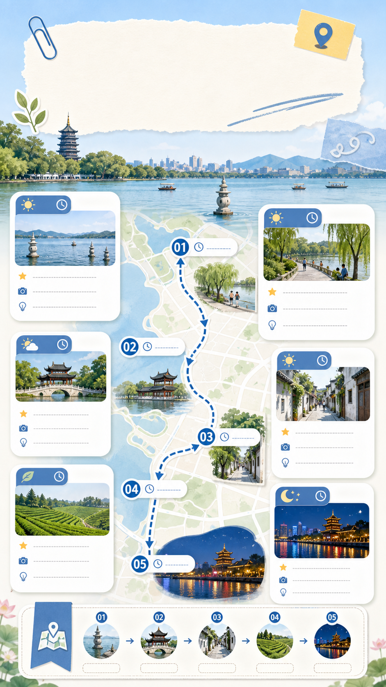

# 周末城市一日游路线卡

## 效果预览



## 适合什么时候用

适合周末游、城市漫游、第一次来某城市怎么玩、朋友圈路线建议和小红书旅行攻略。

## 提示词

```text
Create a vertical 9:16 weekend city itinerary card for {city name}, bright and airy travel guide style, one clear route from morning to night, 5 stops with time labels, simple map path, small landmark illustrations, rounded white information cards, practical tips, clean social-media layout, soft blue and cream palette, readable hierarchy, save-worthy.
```

## 使用建议

- 把 `{city name}` 替换成具体城市。
- 如果城市空间关系复杂，补充“从西到东”或“老城到新城”等路线约束。
- 中文小字不稳定时，可以先生成版式，再后期补文案。

## 变量说明

- 优先替换提示词里的占位变量，例如 `{主体}`、`{城市名称}`、`{产品名称}`、`{品牌风格}`。
- 如果没有显式占位变量，就替换主体名词、场景名词和发布渠道，保留构图、材质、光线和比例约束。
- 标签和 `scene` 用于检索，不一定需要原样写进生成提示词。

## 生成注意事项

- 生成后优先检查文字、数字、地图、UI 元素和品牌标识是否准确。
- 如果画面包含真实城市、路线、产品结构或界面细节，建议补充更具体的空间关系和视觉约束。
- 如果第一次结果偏乱，先减少信息量，再逐步增加卡片、标签或装饰元素。

## 来源

- 原始来源：`self-curated`
- 收录时间：`2026-05-03`
