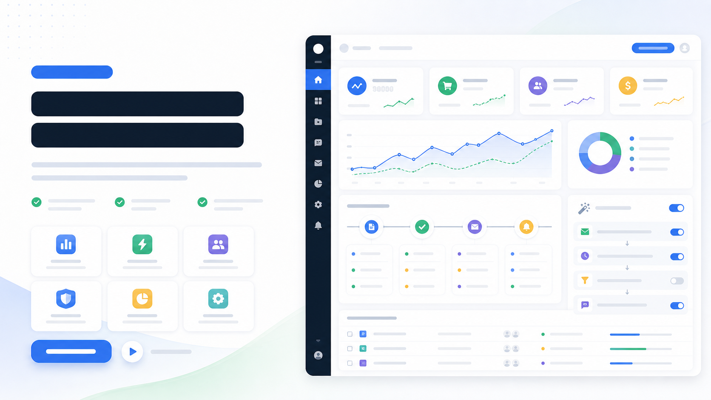

# 功能亮点分屏官网图

## 效果预览



## 适合什么时候用

适合产品官网、功能介绍页、落地页模块图、发布页和品牌产品说明页。

## 提示词

```text
Design a split-layout landing page visual that pairs a bold feature statement on one side with an elegant product interface on the other, clean whitespace, modern B2B SaaS styling, subtle motion feeling, premium interface composition, persuasive but calm product-marketing tone.
```

## 使用建议

- 适合做成一套系列，每个卖点一张。
- 想更科技一点，可补 `futuristic interface glow`。
- 想更偏内容产品，可补 `editorial product storytelling layout`。

## 变量说明

- 优先替换提示词里的占位变量，例如 `{主体}`、`{城市名称}`、`{产品名称}`、`{品牌风格}`。
- 如果没有显式占位变量，就替换主体名词、场景名词和发布渠道，保留构图、材质、光线和比例约束。
- 标签和 `scene` 用于检索，不一定需要原样写进生成提示词。

## 生成注意事项

- 生成后优先检查文字、数字、地图、UI 元素和品牌标识是否准确。
- 如果画面包含真实城市、路线、产品结构或界面细节，建议补充更具体的空间关系和视觉约束。
- 如果第一次结果偏乱，先减少信息量，再逐步增加卡片、标签或装饰元素。

## 来源

- 原始来源：`self-curated`
- 收录时间：`2026-05-03`
