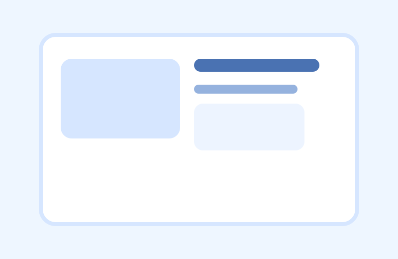

# SaaS 仪表盘官网首屏图

## 效果预览



## 适合什么时候用

适合 SaaS 官网、产品首页、路演页、产品介绍页和功能总览首屏。

## 提示词

```text
Create a premium SaaS landing page hero visual featuring a clean analytics dashboard, soft blue-white palette, polished data widgets, modern startup aesthetic, large headline space on one side, trustworthy product-design feel, crisp UI hierarchy, minimal but aspirational, ideal for a software homepage.
```

## 使用建议

- 最重要的是 `large headline space on one side`，方便你后期自己加文案。
- 这条适合把 AI、CRM、数据分析、协作工具都包装成更成熟的官网视觉。
- 想更偏融资 Deck，可以补 `investor-ready presentation tone`。

## 来源

- 原始来源：`self-curated`
- 收录时间：`2026-05-03`
