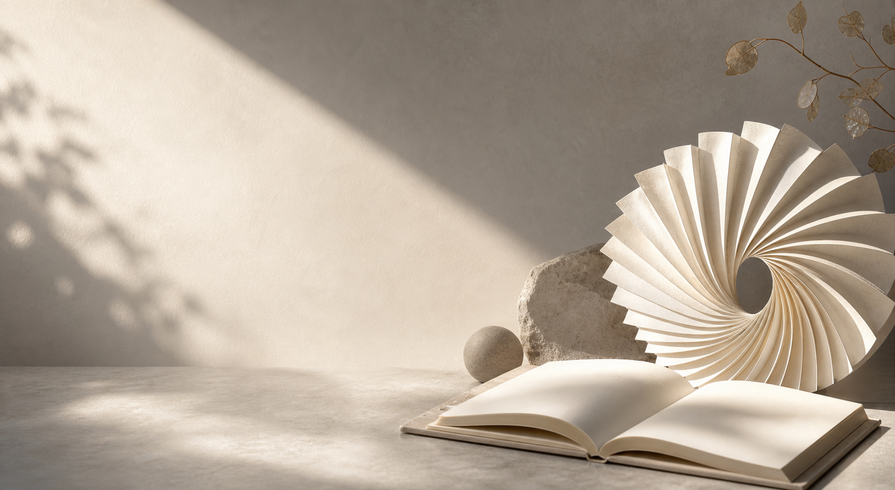

# 公众号长文头图

## 效果预览



## 适合什么时候用

适合公众号长文、专栏文章、品牌思考、行业评论、访谈导语和专题头图。

## 提示词

```text
Create an editorial-style hero image for a long-form WeChat article, understated but premium, soft neutral palette, magazine-feature composition, one elegant focal subject, generous headline space, calm visual rhythm, thoughtful and intelligent atmosphere, suitable for deep writing and reflective commentary.
```

## 使用建议

- 这类头图不要太花，重点是 `generous headline space` 和 `thoughtful atmosphere`。
- 很适合后期自己加文章标题和栏目标识。
- 如果想更商业品牌感，可补 `luxury brand editorial tone`。

## 来源

- 原始来源：`self-curated`
- 收录时间：`2026-05-03`
