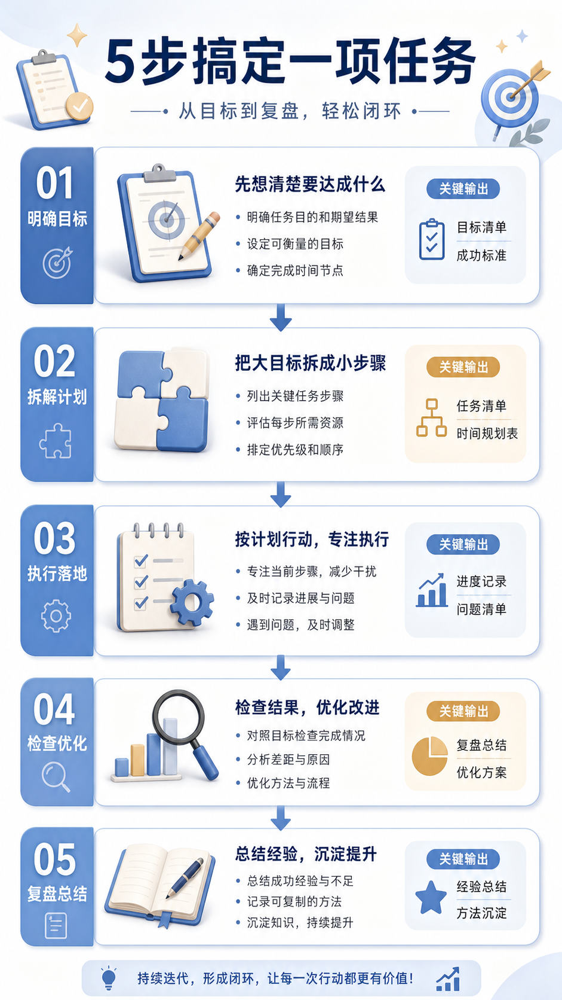

# 流程拆解长图

## 效果预览



## 适合什么时候用

适合 SOP 教程、工作流拆解、产品流程介绍、决策框架、复盘方法和课程讲义配图。

## 提示词

```text
Create a vertically structured process-breakdown graphic for a WeChat article, step-by-step blocks, arrows and relationship cues, clean Chinese infographic style, soft professional colors, easy-to-follow visual order, suitable for SOP explanation, teaching flow, product workflow or decision framework.
```

## 使用建议

- 如果内容较长，最好自己先列出 3 到 6 个步骤再喂给模型。
- 关键在于 `easy-to-follow visual order`，不要为了炫而牺牲清晰度。
- 可以和仓库里的信息图类卡片搭配使用。

## 变量说明

- 优先替换提示词里的占位变量，例如 `{主体}`、`{城市名称}`、`{产品名称}`、`{品牌风格}`。
- 如果没有显式占位变量，就替换主体名词、场景名词和发布渠道，保留构图、材质、光线和比例约束。
- 标签和 `scene` 用于检索，不一定需要原样写进生成提示词。

## 生成注意事项

- 生成后优先检查文字、数字、地图、UI 元素和品牌标识是否准确。
- 如果画面包含真实城市、路线、产品结构或界面细节，建议补充更具体的空间关系和视觉约束。
- 如果第一次结果偏乱，先减少信息量，再逐步增加卡片、标签或装饰元素。

## 来源

- 原始来源：`self-curated`
- 收录时间：`2026-05-03`
