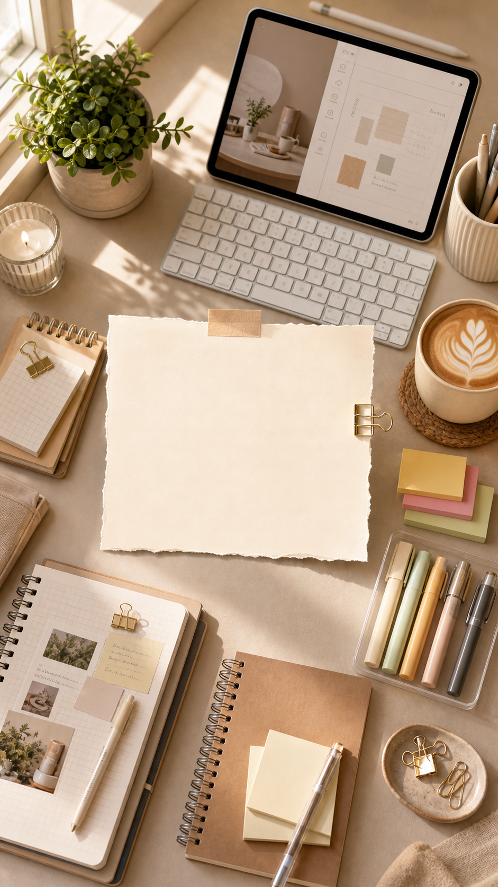

# 桌面摆拍教程首图

## 效果预览



## 适合什么时候用

适合学习方法、效率工具、手账文具、工作流分享、桌面 setup、教程合集类图文。

## 提示词

```text
Create a Xiaohongshu tutorial cover featuring a curated desk flatlay, neatly arranged tools and stationery, warm neutral palette, cozy creator workspace vibe, central topic highlight, balanced composition, premium lifestyle aesthetics, clear title space, ideal for productivity or study content.
```

## 使用建议

- 这条很吃“物件选择”，你可以把 notebook、iPad、keyboard、sticky note 等具体写进去。
- 适合做系列栏目，因为统一桌面色调后识别度很高。
- 想更偏日常生活感，可补 `natural daylight by the window`。

## 来源

- 原始来源：`self-curated`
- 收录时间：`2026-05-03`
