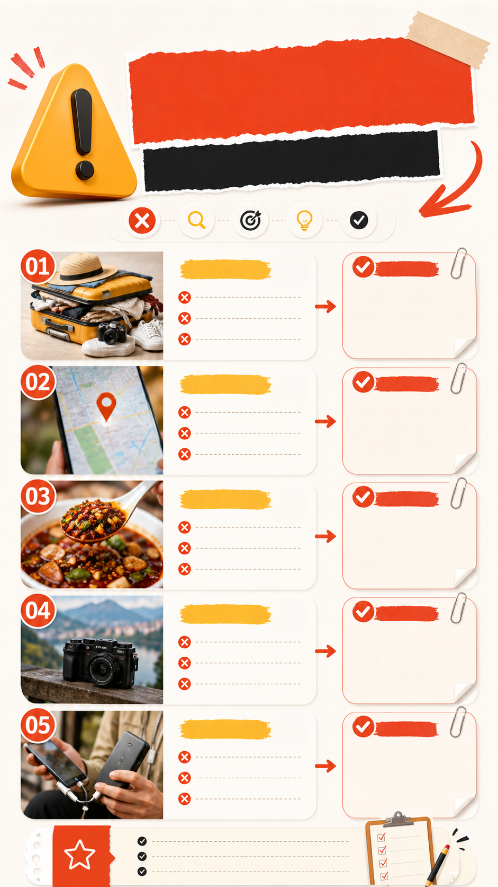

# 避坑指南型首图

## 效果预览



## 适合什么时候用

适合装修避坑、旅行避坑、AI 工具避坑、购物避坑、职场新手避坑等内容。

## 提示词

```text
Create a high-click Xiaohongshu cover for a mistake-avoidance guide, bold warning-style headline area, 3 to 5 clear mistake cards, red-orange attention accents balanced with clean white space, friendly icons, useful checklist feeling, modern creator layout, readable hierarchy, not scary, designed to make people want to save the post.
```

## 使用建议

- 最好后期人工加中文标题，减少生成文字乱码。
- `not scary` 可以避免过度惊悚或廉价警告风。
- 如果想更专业，可补 `minimal editorial style`。

## 变量说明

- 优先替换提示词里的占位变量，例如 `{主体}`、`{城市名称}`、`{产品名称}`、`{品牌风格}`。
- 如果没有显式占位变量，就替换主体名词、场景名词和发布渠道，保留构图、材质、光线和比例约束。
- 标签和 `scene` 用于检索，不一定需要原样写进生成提示词。

## 生成注意事项

- 生成后优先检查文字、数字、地图、UI 元素和品牌标识是否准确。
- 如果画面包含真实城市、路线、产品结构或界面细节，建议补充更具体的空间关系和视觉约束。
- 如果第一次结果偏乱，先减少信息量，再逐步增加卡片、标签或装饰元素。

## 来源

- 原始来源：`self-curated`
- 收录时间：`2026-05-03`
