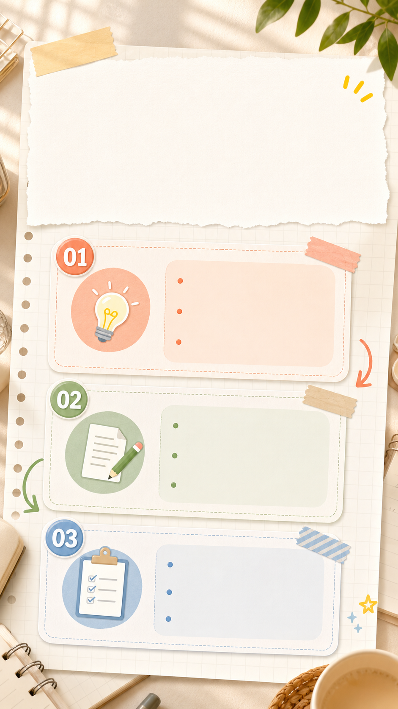

# 三步教程型首图

## 效果预览



## 适合什么时候用

适合“3 步学会”“新手入门”“一图看懂流程”“从 0 到 1”这类教程内容。

## 提示词

```text
Create a clean Xiaohongshu tutorial cover showing a simple 3-step process, large title area, three numbered panels with friendly icons, soft notebook paper texture, warm sunlight, tidy creator desk details, high readability, calm pastel palette, useful and approachable visual style, designed for how-to content.
```

## 使用建议

- 把“三步”保留下来，用户一眼能知道内容有结构。
- 可补充具体主题，例如 `for learning ChatGPT image prompts`。
- 如果不想要桌面元素，去掉 `creator desk details`。

## 变量说明

- 优先替换提示词里的占位变量，例如 `{主体}`、`{城市名称}`、`{产品名称}`、`{品牌风格}`。
- 如果没有显式占位变量，就替换主体名词、场景名词和发布渠道，保留构图、材质、光线和比例约束。
- 标签和 `scene` 用于检索，不一定需要原样写进生成提示词。

## 生成注意事项

- 生成后优先检查文字、数字、地图、UI 元素和品牌标识是否准确。
- 如果画面包含真实城市、路线、产品结构或界面细节，建议补充更具体的空间关系和视觉约束。
- 如果第一次结果偏乱，先减少信息量，再逐步增加卡片、标签或装饰元素。

## 来源

- 原始来源：`self-curated`
- 收录时间：`2026-05-03`
