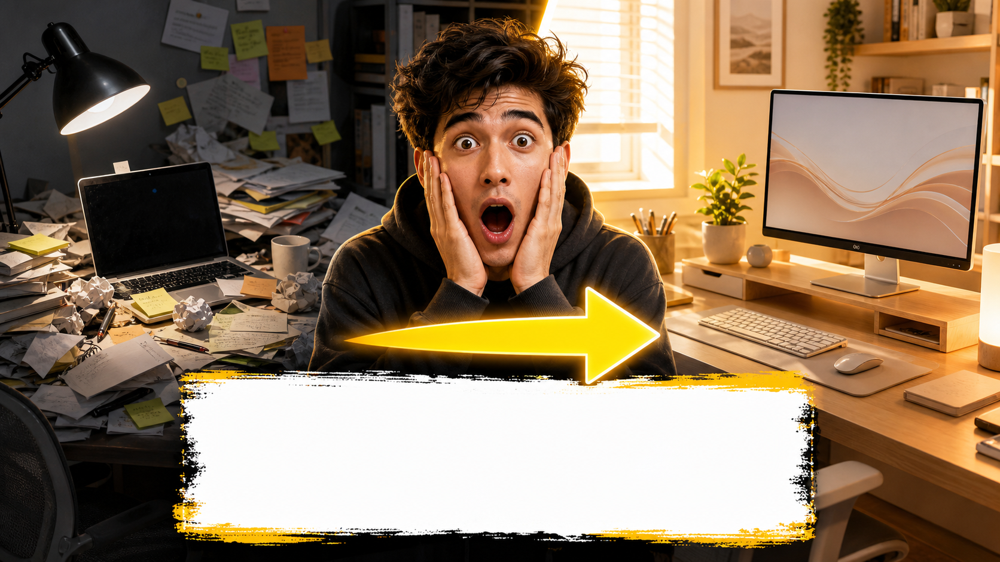

# 夸张前后对比缩略图

## 效果预览



## 适合什么时候用

适合改图前后、空间改造、效率提升、妆容变化、账号包装升级等内容。

## 提示词

```text
Design an attention-grabbing before-and-after YouTube thumbnail, left side dull and messy, right side bright and transformed, dramatic arrow in the center, emotionally expressive subject, strong contrast, clean background, oversized compositional difference, highly clickable makeover content style.
```

## 使用建议

- 这条的点击感很依赖左右差异，一定要写清楚两侧状态。
- 如果主体不是人物，也可以换成房间、页面、设计稿、商品图。
- 想更夸张一点，可补 `extreme thumbnail contrast`。

## 来源

- 原始来源：`self-curated`
- 收录时间：`2026-05-03`
