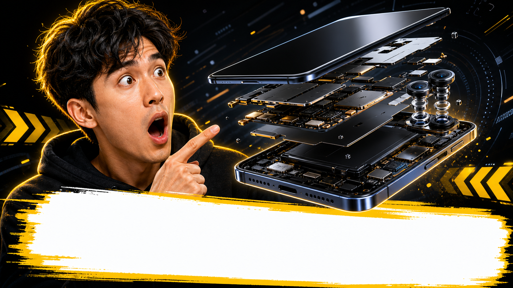

# 科技拆解反应缩略图

## 效果预览



## 适合什么时候用

适合数码评测、AI 工具演示、产品拆解、功能体验、惊喜发现类视频。

## 提示词

```text
Create a tech-channel YouTube thumbnail featuring a shocked creator reaction next to a floating exploded gadget breakdown, bright outline glow, premium dark background, strong depth, urgent visual hierarchy, large object close-up, cinematic but exaggerated thumbnail composition, room for short bold text.
```

## 使用建议

- 可以把 `gadget breakdown` 换成你的核心画面主体。
- 这条很适合和仓库里的“爆炸视图”类提示词组合使用。
- 如果想更像真人频道封面，可补 `front-facing reaction portrait`。

## 来源

- 原始来源：`self-curated`
- 收录时间：`2026-05-03`
